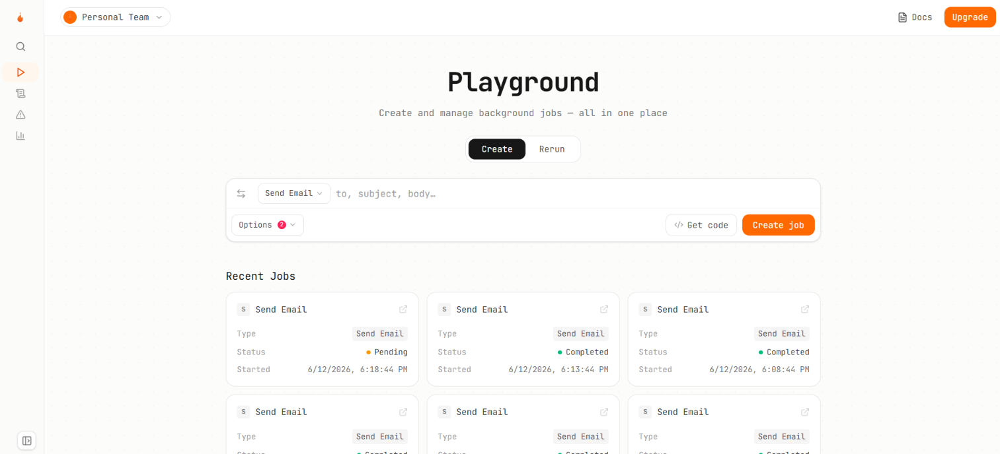

# Zubbee Scheduler

A background job scheduler with priority queuing, retries, dead-letter queue, and a live React dashboard. This was built as part of the Dilamme R&D Stage 9 challenge.

---

## What It Does

Jobs can get created, queued, processed, and tracked. Workers run independently in the background to handle failure on its own in any of the scheduled jobs. A scheduler that only works in the happy path is broken and tries a maximum of 3 times. If it remains failed after 3 tries, it is added to the dead letter queue that can be reviewed and retried again.

## 

## Setup

### Prerequisites

- Node.js v20+
- npm

### Install

```bash
git clone https://github.com/Zubbee18/zubbee-scheduler.git
cd zubbee-scheduler
npm install
```

### Start the server

```bash
node src/index.js
node start index.js
```

### Start the worker

```bash
node src/worker.js
node start worker-start.js
```

---

## API Endpoints

### Create a job

```bash
curl -X POST http://localhost:3000/jobs \
  -H "Content-Type: application/json" \
  -d '{"type":"send_email","priority":1,"payload":{"to":"test@gmail.com","subject":"Hello"}}'
```

### Get a job

```bash
curl http://localhost:3000/jobs/1
```

### Filter by status

```bash
curl http://localhost:3000/jobs?status=failed
```

### Cancel a job

```bash
curl -X PATCH http://localhost:3000/jobs/1/cancel
```

### View dead-letter queue

```bash
curl http://localhost:3000/dlq
```

### Manually retry a DLQ job

```bash
curl -X POST http://localhost:3000/dlq/1/retry
```
